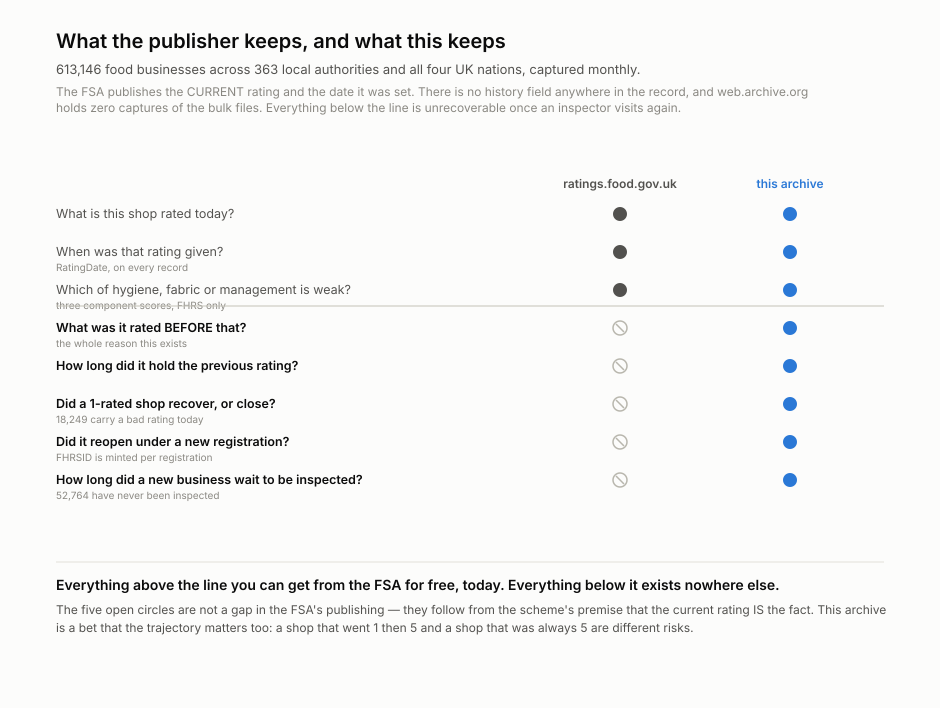
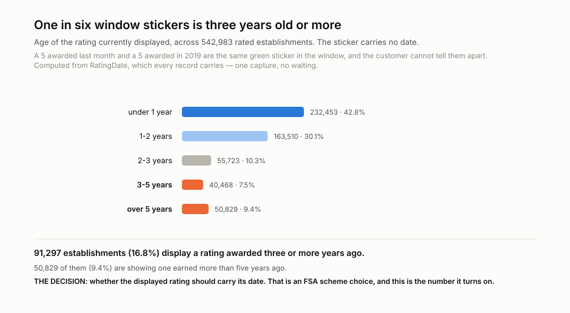
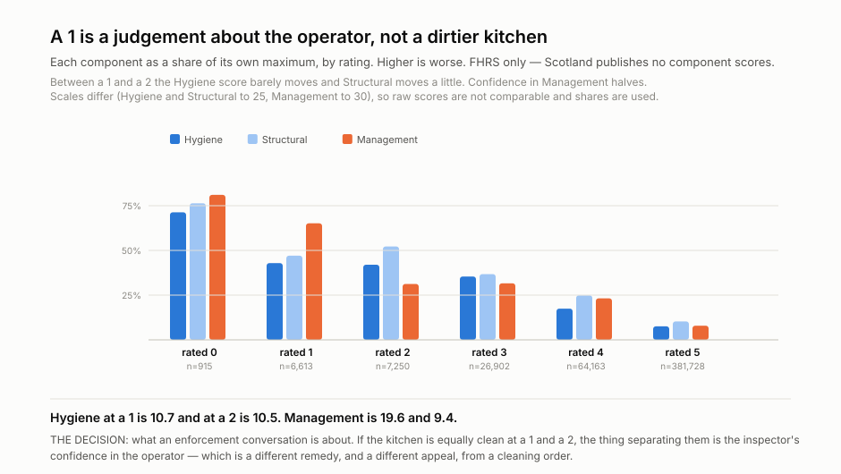
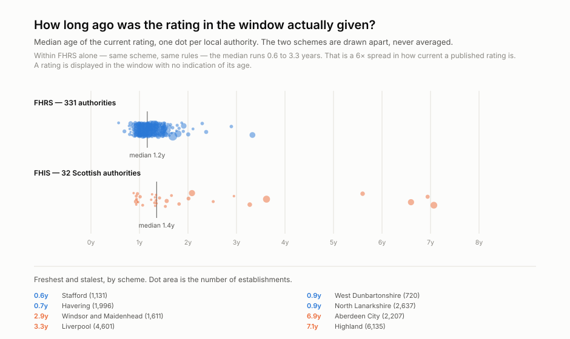
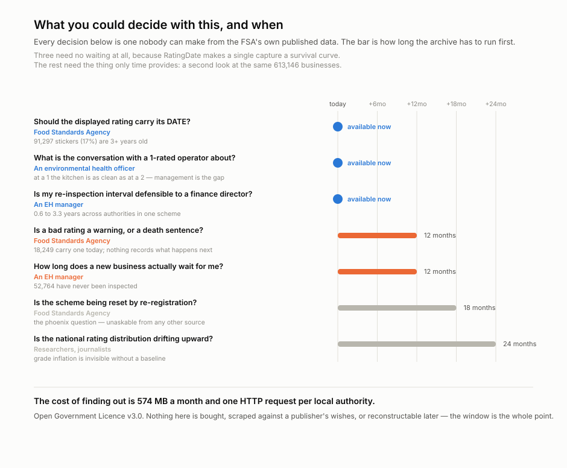
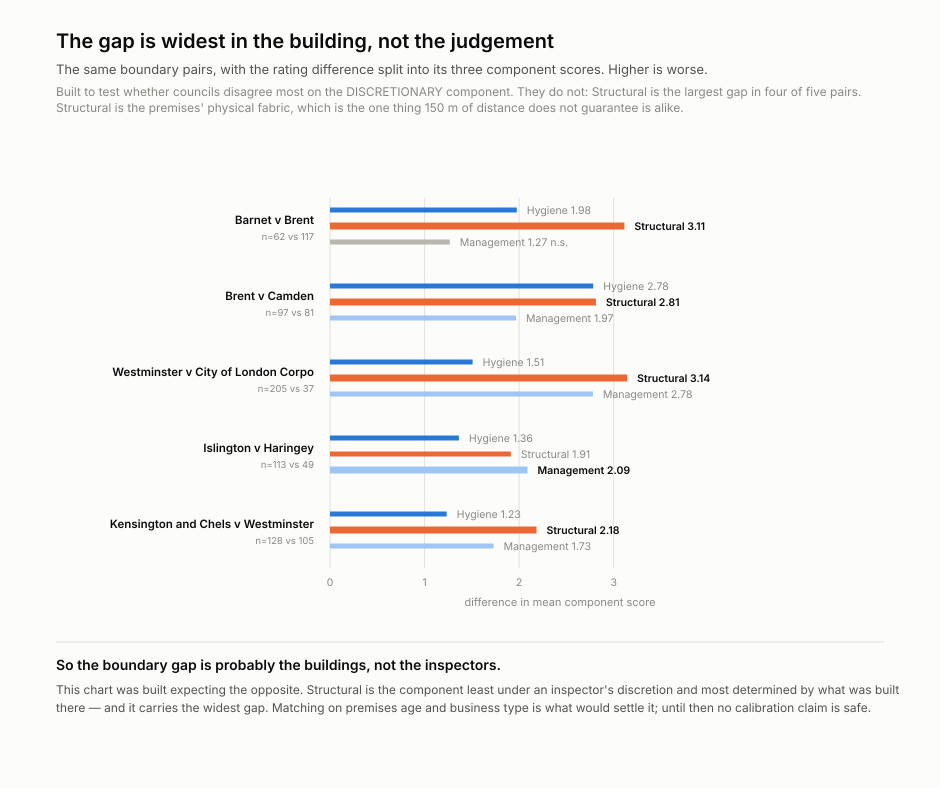

# wss-uk-food-safety — UK Food Safety Ratings

A GitHub Actions pipeline that captures every UK food hygiene rating **every
month** and keeps the one that was there before it.

> **Status: pilot, first capture taken. Local only, not published.**
>
> One capture of 363 authority files is in. Three questions are already
> answered; the rest need a second look at the same 613,146 businesses.

**A food hygiene rating is a photograph presented as a live feed.**

613,146 UK food businesses display a sticker asserting *this place is a 5*.
**16.8% of those ratings were awarded three or more years ago; 9.4% more than
five.** The sticker carries no date, and the Food Standards Agency publishes
only the current value — so when an inspector visits again, the rating that was
there before is overwritten and gone.

That is not an oversight in the FSA's publishing. It follows from the scheme's
premise: the current rating **is** the fact, so history does not exist. This
archive is a bet that the trajectory matters too — a shop that went 1 then 5 and
a shop that was always 5 are different risks, and the scheme says they are
identical.

## What is kept, and by whom

<p align="center">
  
</p>

Everything above the line is free from the FSA today. Everything below it exists
nowhere else: no history field in the record, no previous-rating endpoint, and
**zero captures of the bulk files in the Internet Archive**. Backfill was
attempted and failed — 13 stray per-establishment records survive out of
613,146, and the API ignores date parameters.

## Answered already, from one capture

`RatingDate` is on every record, so the age distribution of current ratings is a
survival curve. Three findings needed no waiting.

<p align="center">
  
</p>

**91,297 establishments display a rating awarded three or more years ago.**
Whether that sticker should carry its date is an FSA scheme decision, and this
is the number it turns on.

<p align="center">
  
</p>

**A 1 is a judgement about the operator, not a dirtier kitchen.** Between a 1 and
a 2 the hygiene score is flat (10.7 vs 10.5); confidence in management halves
(19.6 vs 9.4). That is a different remedy, and a different appeal, from a
cleaning order.

<p align="center">
  
</p>

Within FHRS alone — same scheme, same rules — the median age of a rating runs
from **0.6 years (Stafford)** to **3.3 years (Liverpool, 4,601 establishments)**.
Scotland's FHIS is drawn apart and never averaged in; its extremes reach 7.1
years (Highland).

## What listening unlocks

<p align="center">
  
</p>

The cost of finding out is **574 MB a month** and one HTTP request per local
authority, under the Open Government Licence.

## A warning about the boundary result

<p align="center">
  
</p>

Shops within 150 m of a council boundary are rated measurably differently from
those just across it — five pairs with intervals excluding zero, up to 0.60
stars. **Do not read that as councils marking inconsistently.** Splitting the
gaps into components puts the largest difference in **Structural**, the
building's physical fabric, in four of five pairs. The likeliest explanation is
that the premises genuinely differ across the line. Matching on premises age and
business type is what would settle it. See
[`examples/boundary.py`](examples/boundary.py) and **D1** in
[docs/research-questions.md](docs/research-questions.md).

## Eleven authority files are stale, and nothing says so

Observations are dated by the file's own `ExtractDate`, not by when we fetched
it, which split the first capture across five monthly partitions. Dumfries and
Galloway's **2,719 establishments** are served as current from a **May** extract.

## What this cannot do

- **Map outbreaks.** UKHSA publishes nothing at premises level. The geocode on
  every record is one side of a join whose other side does not exist.
- **Score an individual premises' risk.** The cohorts support base rates and
  group comparisons, not per-shop prediction.
- **Reach Scotland's component scores.** FHIS publishes none, and its vocabulary
  (`Pass`, `Improvement Required`) is never averaged with the 0–5 scale.

## The data you get

The files to query are `derived/observations/<YYYY-MM>.csv` — one row per
entity, per metric, per day:

```
series_id, entity_id, observed_at, captured_at, metric, value, unit, source_id, raw_ref, parser_version
```

- `entity_id` — the thing being measured
- `observed_at` / `captured_at` — when the fact was true / when we saw it
- `raw_ref` — the archived response the row was parsed from, so every number
  is checkable back to bytes

```bash
head derived/observations/*.csv            # no tooling required
python examples/load_observations.py       # sqlite + example queries
duckdb -c "SELECT * FROM read_csv_auto('derived/observations/*.csv') LIMIT 5"
```

## Coverage

Date ranges are machine-readable in [health/health.csv](health/health.csv)
(`first_success_at` → `last_success_at`, updated each run).

| series | what it lists | covered since | status |
| --- | --- | --- | --- |
| _add a row per source_ | | | ongoing |

Rules for this table: a **new series** gets a row with the date coverage
starts; a **discontinued series** keeps its row with a *covered until* date
and status *discontinued* — its data stays in the repo forever. Nothing
already published is removed.

## What you can build from it

<!-- TODO: the end products. Trend curves, leaderboards, survival analysis,
     divergence between attention and usage — whatever this domain supports. -->

## How it runs

Three scheduled workflows a day — capture (22:10 UTC), health (23:40),
derive (00:20) — powered by the
[wss](https://github.com/q3dresearch/wss) engine, pinned to one
version. No workflow ever names a source: capture shards whatever
`registry/` marks active, so infrastructure never changes when sources do.
The bot commits **data only** — it never changes code; the one config it may
touch is flipping a repeatedly-failing source to `auto_disabled`, with an
issue explaining why.

## Adding a source

1. Add `registry/<source_id>.yml` (copy the example entry), `status: paused`.
2. Add a parser in `parsers/` if the payload shape is new.
3. `wss doctor <source_id>` — **read the raw response**.
4. Flip to `status: active`, add a Coverage row, commit.

Nothing else. No workflow edits, ever.

## Run it locally

```bash
python -m venv .venv && . .venv/bin/activate
pip install -r requirements.txt
export WSS_CONTACT="you@example.com"   # identifies you to publishers

wss validate
wss doctor <source_id>
wss capture --cadence monthly
wss derive --parsers parsers.<module>
wss health --dry-run
```

## Going live

1. Push this repo **and the engine repo** under the same GitHub owner
   (`q3dresearch`) — the workflows install the engine from
   `github.com/q3dresearch/wss` at the pinned tag.
2. Set the repo secret **`WSS_CONTACT`** — capture refuses to run
   without it.
3. Run `capture-monthly` once by hand (Actions → capture-monthly → Run
   workflow), confirm the bot's data commit lands, then let the cron take
   over.

## Licences

**Data: Open Government Licence v3.0.** The ratings are published by the Food
Standards Agency. Attribution is required:

> Contains public sector information licensed under the Open Government Licence
> v3.0. Source: Food Standards Agency, https://ratings.food.gov.uk/open-data

The OGL does not permit implying FSA endorsement of this repository, and none is
claimed. Where this archive and ratings.food.gov.uk disagree about a current
rating, **the FSA is right and this is stale** — the point of this repository is
the values the FSA no longer shows, not the ones it does.

**Code: MIT.** See [`LICENSE`](LICENSE) and [`LICENSE-DATA`](LICENSE-DATA).
