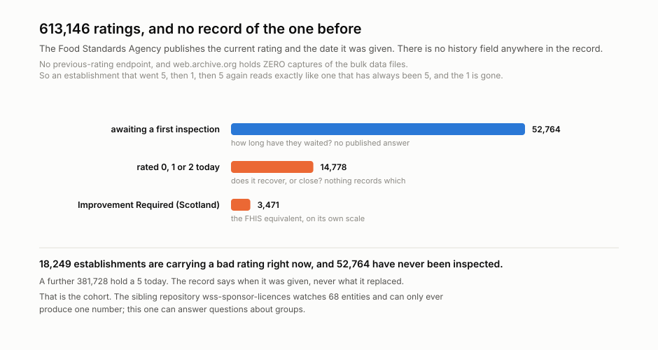
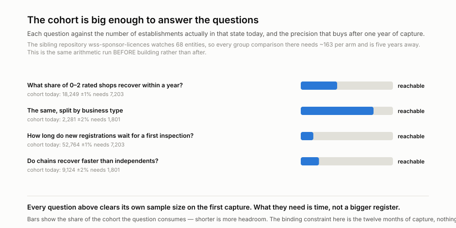

# wss-food-hygiene — UK Food Hygiene Ratings

<!-- TODO: one paragraph. What does this capture, and why would the history
     otherwise be lost? The "why" is the reason anyone will care: name the
     window the publisher exposes (rolling counts, current status, today's
     listing) and the fact that uncaptured days are gone for good. -->

A GitHub Actions pipeline that captures every UK food hygiene rating **every month** and keeps
the one that was there before it.

> **Status: pilot, first capture taken. Local only, not published.**
>
> One capture of 363 authority files is in. The second is what makes any of this
> answerable — nothing below is a finding yet.

**A food hygiene rating is a regulator's verdict on one shop on one day, shown
in the window and published nationally. The Food Standards Agency publishes the
current rating and the date it was given — and nothing else.**

There is no history field in the record, no previous-rating endpoint, and
**web.archive.org holds zero captures of the bulk data files**. An establishment
that went 5, then 1, then 5 again is indistinguishable from one that has always
been 5.

## What is being watched

<p align="center">
  
</p>

**613,146 establishments across 363 local authorities.** 52,764 have never been
inspected. 18,249 are carrying a bad rating right now. In the authority sampled
during screening, 36.9% were re-rated within twelve months, which scales to
roughly **226,000 rating events a year**.

That cohort is why this register was chosen over others. The sibling repository
wss-sponsor-licences watches **68** entities and can only ever produce a single
base rate; this one can answer questions about groups.

## The rating in the window has no date on it

<p align="center">
  
</p>

Within FHRS alone — same scheme, same rules — the median age of a current rating
runs from **0.6 years (Stafford)** to **3.3 years (Liverpool, 4,601
establishments)**. A rating is displayed with no indication of its age, so two
shops both showing 5 may be nine months and four years apart in evidence.

Scotland's FHIS is drawn separately and never averaged in: its values are
`Pass` / `Improvement Required` / `Pass and Eat Safe`, with no component scores
at all, and its extremes run to 7.1 years (Highland).

## Eleven authority files are stale, and nothing says so

Observations are dated by the file's own `ExtractDate`, not by when we fetched
it. That immediately split the first capture across **five monthly partitions**:
352 authorities were extracted in September 2026, and eleven were not.

| authority | extracted | establishments |
| --- | --- | --- |
| River Tees | 2026-04-22 | 3 |
| Hull and Goole Port | 2026-04-28 | 5 |
| **Dumfries and Galloway** | **2026-05-23** | **2,719** |
| Castle Point | 2026-07-22 | 537 |
| Tamworth | 2026-07-24 | 558 |

Dumfries and Galloway's 2,719 establishments are served as current from a May
extract. Nothing on the FSA site flags it.

## What it can answer, and when

<p align="center">
  
</p>

Every question in [docs/research-questions.md](docs/research-questions.md)
clears its own required sample size **on the first capture**. The binding
constraint is time, not register size — which is the opposite of the sibling
repo, and the reason this one was built.

## The data you get

The files to query are `derived/observations/<YYYY-MM>.csv` — one row per
entity, per metric, per day:

```
series_id, entity_id, observed_at, captured_at, metric, value, unit, source_id, raw_ref, parser_version
```

- `entity_id` — the thing being measured
- `observed_at` / `captured_at` — when the fact was true / when we saw it
- `raw_ref` — the archived response the row was parsed from, so every number
  is checkable back to bytes

```bash
head derived/observations/*.csv            # no tooling required
python examples/load_observations.py       # sqlite + example queries
duckdb -c "SELECT * FROM read_csv_auto('derived/observations/*.csv') LIMIT 5"
```

## Coverage

Date ranges are machine-readable in [health/health.csv](health/health.csv)
(`first_success_at` → `last_success_at`, updated each run).

| series | what it lists | covered since | status |
| --- | --- | --- | --- |
| _add a row per source_ | | | ongoing |

Rules for this table: a **new series** gets a row with the date coverage
starts; a **discontinued series** keeps its row with a *covered until* date
and status *discontinued* — its data stays in the repo forever. Nothing
already published is removed.

## What you can build from it

<!-- TODO: the end products. Trend curves, leaderboards, survival analysis,
     divergence between attention and usage — whatever this domain supports. -->

## How it runs

Three scheduled workflows a day — capture (22:10 UTC), health (23:40),
derive (00:20) — powered by the
[wss](https://github.com/q3dresearch/wss) engine, pinned to one
version. No workflow ever names a source: capture shards whatever
`registry/` marks active, so infrastructure never changes when sources do.
The bot commits **data only** — it never changes code; the one config it may
touch is flipping a repeatedly-failing source to `auto_disabled`, with an
issue explaining why.

## Adding a source

1. Add `registry/<source_id>.yml` (copy the example entry), `status: paused`.
2. Add a parser in `parsers/` if the payload shape is new.
3. `wss doctor <source_id>` — **read the raw response**.
4. Flip to `status: active`, add a Coverage row, commit.

Nothing else. No workflow edits, ever.

## Run it locally

```bash
python -m venv .venv && . .venv/bin/activate
pip install -r requirements.txt
export WSS_CONTACT="you@example.com"   # identifies you to publishers

wss validate
wss doctor <source_id>
wss capture --cadence monthly
wss derive --parsers parsers.<module>
wss health --dry-run
```

## Going live

1. Push this repo **and the engine repo** under the same GitHub owner
   (`q3dresearch`) — the workflows install the engine from
   `github.com/q3dresearch/wss` at the pinned tag.
2. Set the repo secret **`WSS_CONTACT`** — capture refuses to run
   without it.
3. Run `capture-monthly` once by hand (Actions → capture-monthly → Run
   workflow), confirm the bot's data commit lands, then let the cron take
   over.

## Licences

Two separate files, on purpose: code is MIT ([LICENSE](LICENSE)); data
(`raw/`, `manifest/`, `derived/`) is CC-BY-4.0
([LICENSE-DATA](LICENSE-DATA)), citation in [CITATION.cff](CITATION.cff).
Captured content remains subject to the publisher's own terms.

Topics: `git-scraping` · `open-data` · `point-in-time-data` · `dataset`
